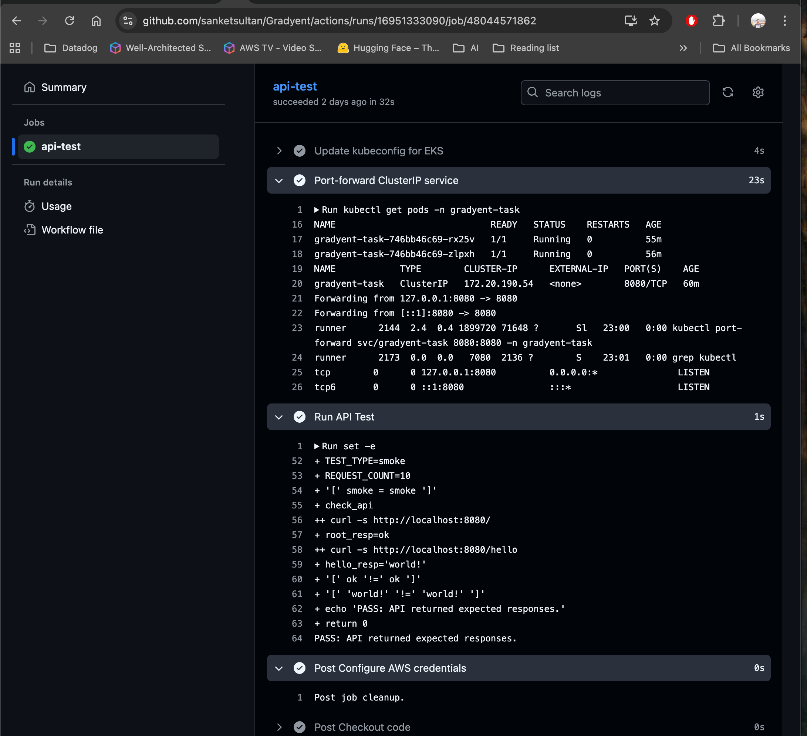

# Here is how I Automate and Deployed Gradyent Tech App

I started by planning what I needed: reliable and scalable infrastructure, good security, clear monitoring, automatic backups, and smooth deployments. I chose AWS EKS for managed Kubernetes, Terraform for infrastructure as code, and Helm for app deployment. For backup and restore, I selected Velero to automate cluster and volume backups. For observability, I integrated Datadog to monitor metrics and logs. To automate deployments and testing, I set up GitHub Actions workflows for CI/CD. To keep code secure, I added Static Application Security Testing (SAST) to the CI/CD pipeline, ensuring vulnerabilities are caught before deployment. I made sure everything was automated, so anyone could repeat my process and get the same results.

---

## Setting Up AWS Credentials

I started by configuring AWS credentials securely, using CI/CD secrets and local profiles. This ensured all automation could access AWS resources safely.

> 

---

## Installing the Right Tools

To work efficiently, I installed Terraform, AWS CLI, kubectl, Helm, and make. These tools helped automate infrastructure and application deployment.

> 

---

## Provisioning Infrastructure with Terraform

Using Terraform, I defined the EKS cluster, VPC, security groups, and storage. Running `make infra` spun up everything reliably and repeatably.

> 

---

## Deploying the Application with Helm

Once the cluster was ready, I packaged the app as a Docker image and deployed it using Helm charts. This made updates and rollbacks simple.

> 

---

## Enabling Ingress and Autoscaling

To expose the app and handle traffic spikes, I set up ingress controllers and horizontal pod autoscaling. This ensured high availability and performance.

> 
> 

---

## Local Testing

I verified everything by port-forwarding and testing endpoints locally. Quick checks confirmed the app was running as expected.

> 

Also I created a automation testing pipeline to test this app https://github.com/sanketsultan/Gradyent/actions/workflows/api-test.yaml

> 

---

## Cleaning Up Resources

When testing was done, I used `make destroy` to clean up all resources, keeping costs under control and the environment tidy.

> 

---

## Key Features I Built In

- **Scalability:** Easily adjust node groups and pod replicas with HPA.
- **Multi-Tenancy:** Each customer/environment gets its own namespace.
- **Monitoring:** Metrics server, Datadog integration, ready for Prometheus/Grafana.
- **Security:** IAM roles, KMS encryption, RBAC, and encrypted secrets.
- **Backup:** Velero for cluster and volume backups.
- **CI/CD:** Automated deployment and testing with GitHub Actions.

---

## Adding Observability with Datadog

For deep monitoring, I integrated Datadog. I added the API key to secrets, updated values, and deployed the Datadog agent with Helm. This gave me real-time metrics and alerts.

> 
> 

---

## Securing Code with SAST

To keep code secure, I set up Static Application Security Testing (SAST) in the CI/CD pipeline. This automatically scanned for vulnerabilities before deployment.

> 
> 

---

## Backup and Restore with Velero

I configured Velero for automated backups and easy restores. This protected both cluster state and persistent data, ensuring quick recovery from any incident.

> 

---

## Organizing Everything

I kept the repo organized:
- `infra/` for Terraform scripts
- `charts/gradyent-task/` for Helm charts
- `observability/` for monitoring configs
- `backup-and-restore/` for Velero
- `.github/workflows/` for CI/CD pipelines

---

## Troubleshooting and Customization

I documented common issues and how to fix them, like pod startup problems, health check failures, and ingress setup. Cluster size and settings are easy to tweak in `infra/variables.tf` or Helm values.

---

## Quick Verification

I used simple kubectl and curl commands to verify deployments and health.

> 

---

## License and Support

See `LICENSE` for usage terms. If you have questions, check the docs or reach out!

---

This approach made the deployment secure, observable, scalable, and easy to manage. Every step was automated and repeatable, so anyone can follow along and get the same results.
