# Gradyent EKS Solution: Step-by-Step Guide

This guide walks you through deploying a robust, scalable, multi-tenant app on AWS EKS using Terraform and Helm. Each step includes instructions and a placeholder for screenshots to help you visualize the process.

---

## Step 1: Set Up AWS Credentials

Configure your AWS credentials in your CI/CD secrets or locally.

> 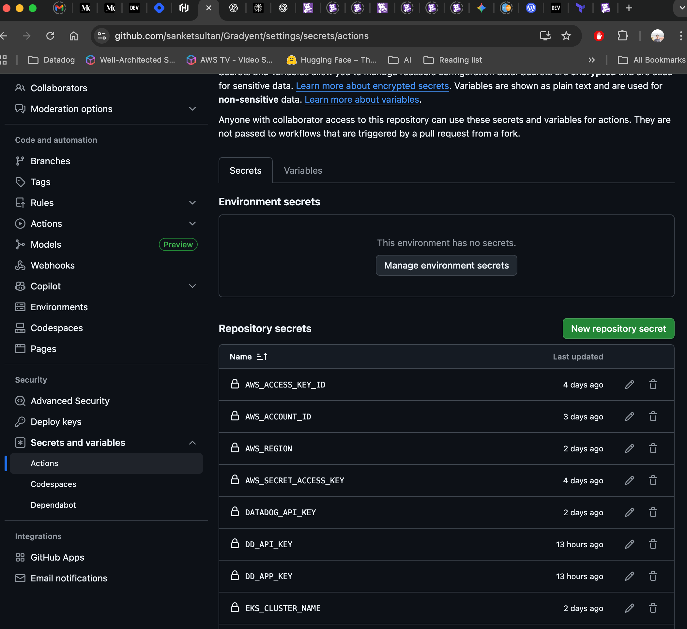

---

## Step 2: Install Required Tools

Make sure you have the following tools installed:

- Terraform >= 1.0
- AWS CLI v2
- kubectl (matching cluster version)
- Helm v3
- make (optional, for shortcuts)

> 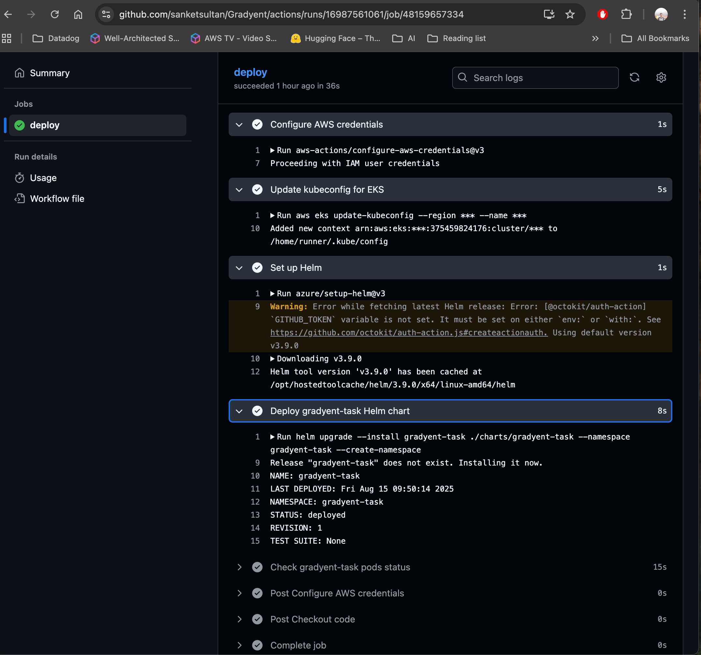

---

## Step 3: Provision Infrastructure

Run the following command to create the EKS cluster, VPC, security, and storage:

```sh
make infra
```

> 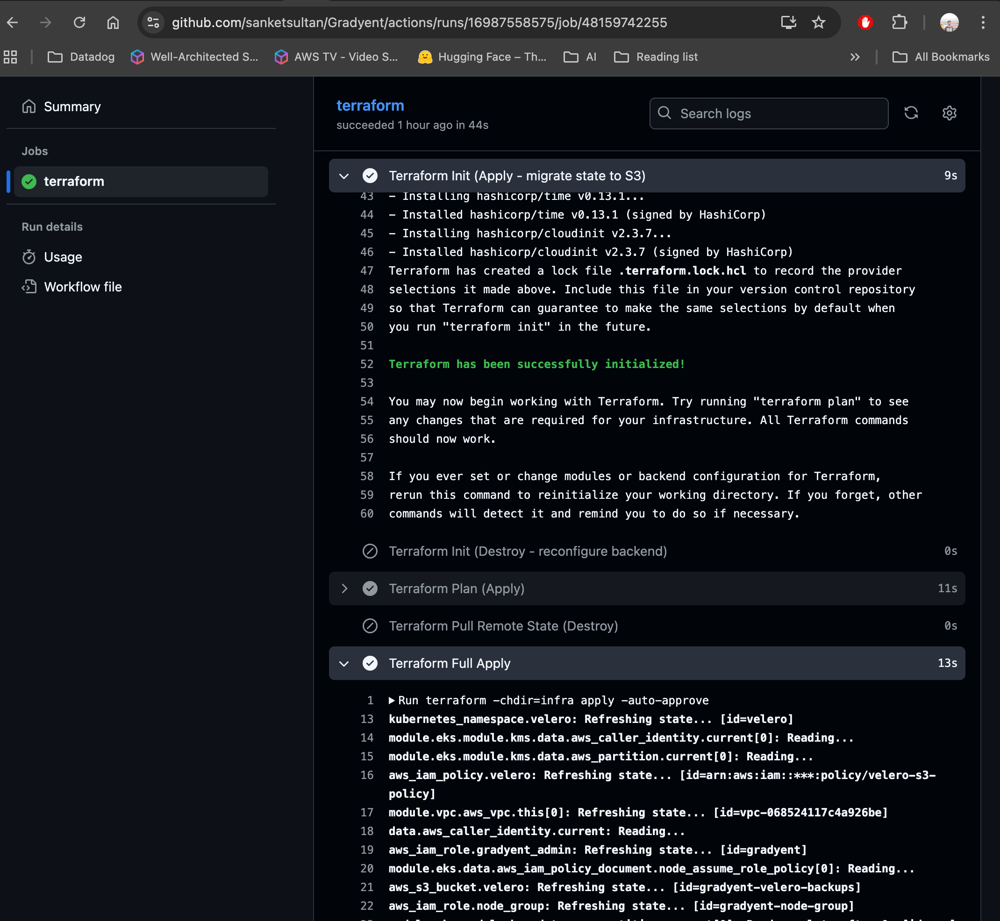

---

## Step 4: Deploy the Application

Deploy the Docker image using Helm:

```sh
make app
```

> 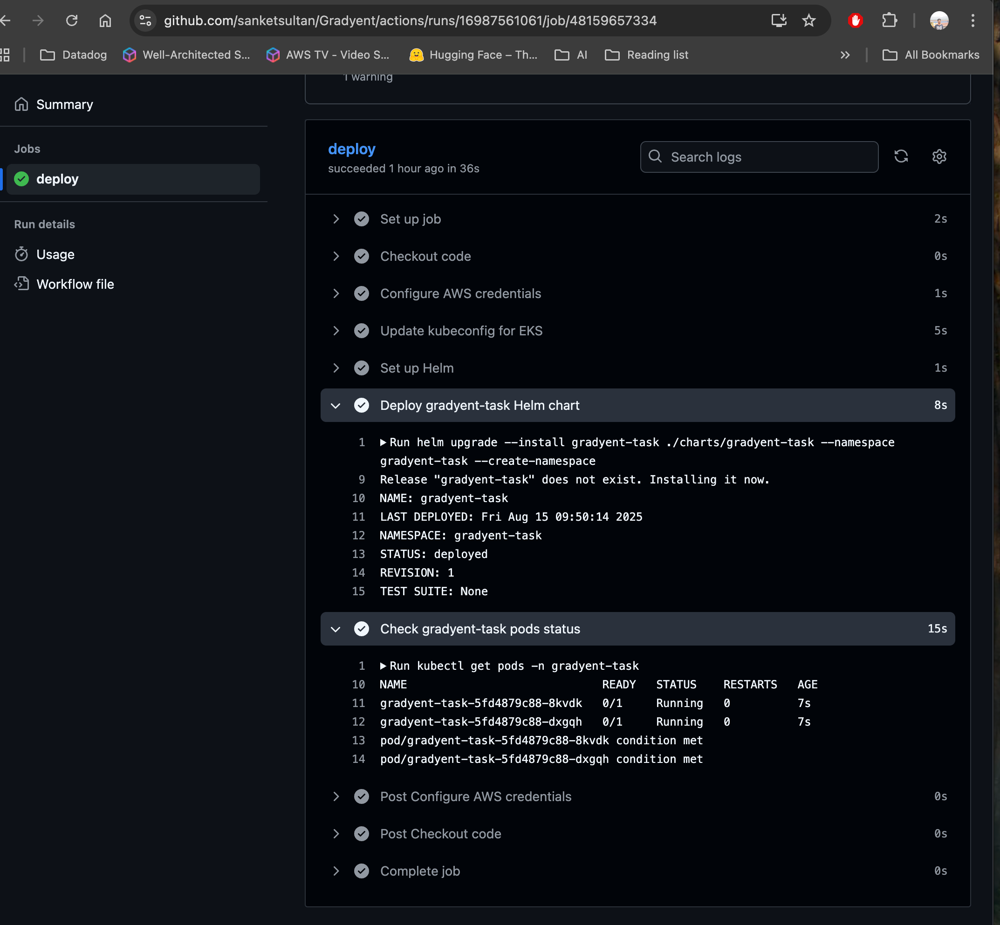

---

## Step 5: Enable Ingress and Autoscaling

Set up ingress and horizontal pod autoscaling:

```sh
make ingress
make hpa
```

> 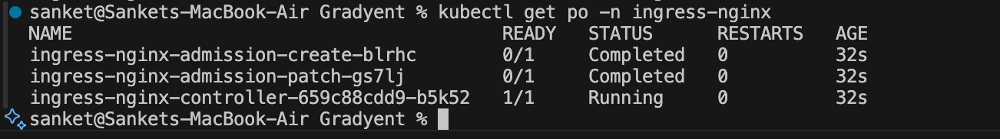
> 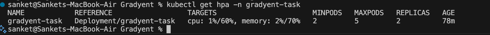

---

## Step 6: Test Locally

Port-forward and test endpoints:

```sh
make port-forward &
curl -s localhost:8080/        # Should return: OK
curl -s localhost:8080/hello   # Should return: world
```

> 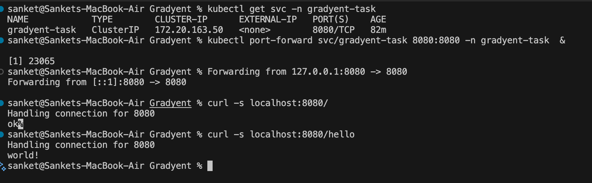

---

## Step 7: Destroy Everything

Clean up resources when done:

```sh
make destroy
```

> 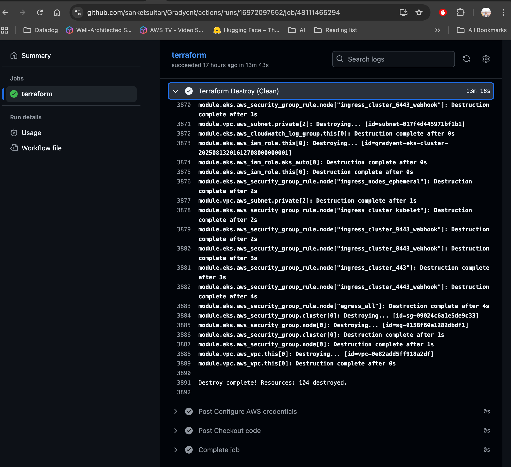

---

## Key Features

- **Scalability:** Easily adjust node group size and pod replicas. HPA enabled.
- **Multi-Tenancy:** Each customer/environment has its own namespace.
- **Monitoring:** Metrics server, optional Datadog, ready for Prometheus/Grafana.
- **Security:** IAM roles, KMS encryption, RBAC, encrypted secrets.
- **Backup:** Velero for cluster and volume backups.
- **CI/CD Ready:** GitHub Actions workflows for automated deployment/testing.

---

## Step 8: Set Up Datadog Monitoring

Integrate Datadog for enhanced observability:

1. Add your Datadog API key to your secrets.
2. Update the values in `observability/datadog-values.yaml`.
3. Deploy the Datadog agent:

    ```sh
    helm upgrade --install datadog-agent datadog/datadog \
      --namespace observability --create-namespace \
      -f observability/datadog-values.yaml
    ```

> 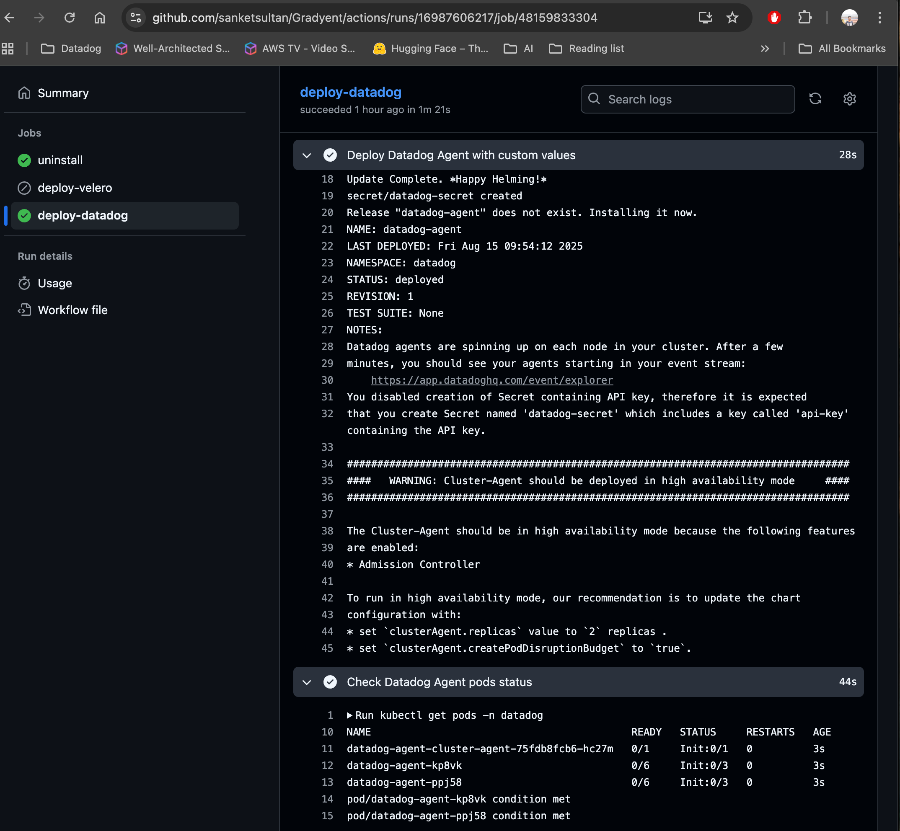
> 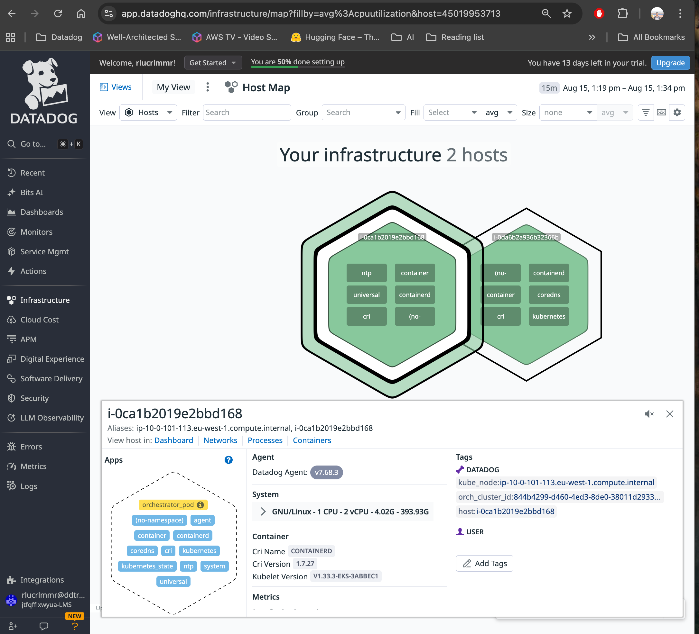

---

## Step 9: Run SAST Scanning

Ensure code security with Static Application Security Testing (SAST):

1. Integrate SAST tools (e.g., Datadog Static Analysis) in your CI/CD pipeline.

https://github.com/sanketsultan/Gradyent/actions/workflows/datadog-static-analysis.yml

2. Example GitHub Actions step:

    ```yaml
    - name: Run Datadog Static Analysis
      uses: DataDog/datadog-static-analysis-action@v1
      with:
        api-key: ${{ secrets.DATADOG_API_KEY }}
    ```
    ```

> 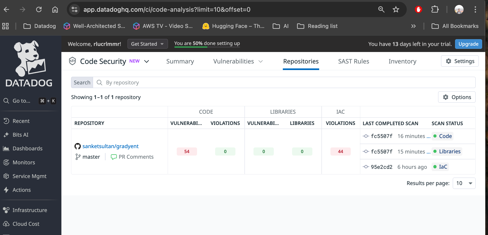
> 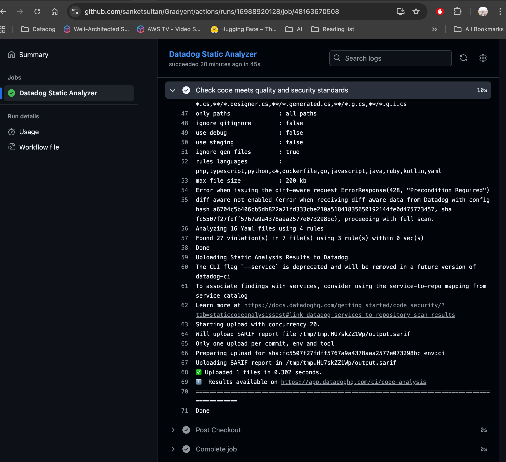

---

## Step 10: Backup and Restore

Protect your cluster and data with Velero:

1. Configure Velero using files in `backup-and-restore/`.
2. Install Velero:

    ```sh
    helm upgrade --install velero vmware-tanzu/velero \
      --namespace velero --create-namespace \
      -f backup-and-restore/velero-values.yaml
    ```
> 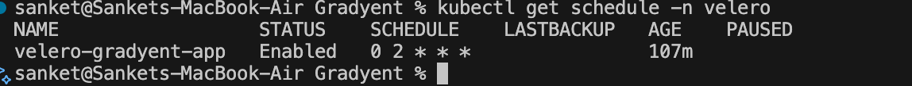

3. To back up:

    ```sh
    velero backup create gradyent-backup --include-namespaces gradyent-task
    ```

4. To restore:

    ```sh
    velero restore create --from-backup gradyent-backup
    ```


---

## File Structure

- `infra/` – Terraform scripts for AWS infrastructure
- `charts/gradyent-task/` – Helm chart for Gradyent app deployment
- `observability/` – Datadog values
- `backup-and-restore/` – Velero configs
- `Makefile` – Shortcut commands
- `.github/workflows/` – CI/CD pipelines

---

## Troubleshooting

- **Pods not starting?** Check node group size and pod resource requests.
- **Health checks failing?** Make sure `/` returns `OK` and `/hello` returns `world`.
- **Ingress not working?** Check ingress controller status and DNS setup.
- **Autoscaling not working?** Ensure metrics-server is installed and HPA is configured.

---

## Customization

Change cluster size, instance types, and other settings in `infra/variables.tf`. Override Helm values at deploy time:

```sh
helm upgrade --install gradyent-task charts/gradyent-task \
    --namespace tenant-a --create-namespace \
    --set replicaCount=4 --set hpa.maxReplicas=10
```
---

## Quick Verification

```sh
kubectl -n gradyent-task get deploy,svc,hpa,ingress
curl -s localhost:8080/hello | grep world && echo "Liveness OK"
```

> 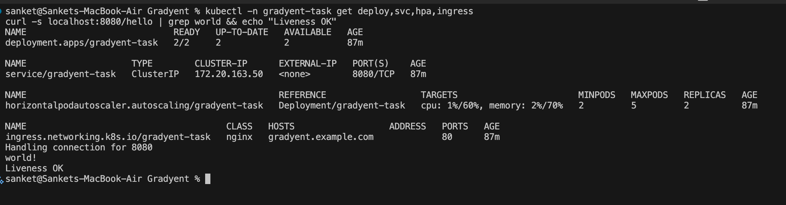

---

## License

See `LICENSE` for usage terms.

---

If you have any questions, just check the docs or reach out. Thanks for reviewing my solution!

